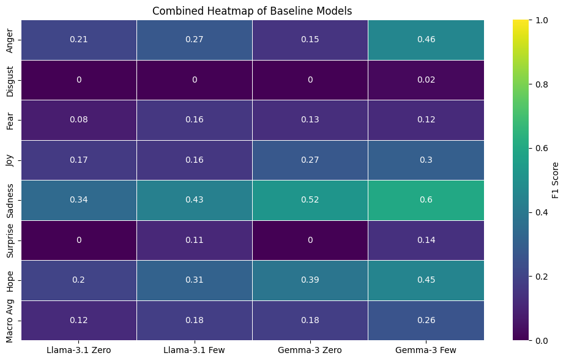

  

<h1 align="center">HISEMOTIONS at IberLEF 2026: Historical Text-Based Emotion Detection in Early Modern Spanish Correspondence</h1>

### 📢📢 **Important Notice on Codabench Access**

**The [Codabench page](https://www.codabench.org/competitions/14140/?secret_key=c6ae8bdb-dd2f-4908-888a-39354eaa0ebd) is now available to run predictions on the dev set.**

### 📢 **Important Notice on Datasets Access**

**February 12, 2026 – Validation Dataset published**

 **To download the validation datasets, please visit [Validation Dataset Page](dev/).**  
 

- [Description of the Task](#description-of-the-task)
  - [Overview](#overview)
  - [Relevance and Novelty](#relevance-and-novelty)
  - [Challenges Involved](#challenges-involved)
  - [Methodological Aspects](#methodological-aspects)
- [Dataset](#dataset)
  - [Annotation Procedure](#annotation-procedure)
- [Baselines](#baselines)
- [Task setup](#task-setup)
- [Schedule](#schedule)
- [Organisation Committee](#organisation-committee)
- [Funding](#funding)
- [Relevant Issues](#relevant-issues)
- [References](#references)

  
## Description of the Task

### Overview

  
**HISEMOTIONS 2026** proposes a shared task focused on Text-Based Emotion Detection (TBED) in Early Modern Spanish epistolary texts (16th-17th centuries). The task aims to foster the development and evaluation of NLP methods specifically adapted to historical Spanish language varieties, addressing the semantic and diachronic challenges of emotion and affective states expression in Early Modern Spanish correspondence.  
  
Previous IberLEF shared tasks on sentiment and emotion analysis have focused on contemporary Spanish and modern genres (e.g., social media, reviews, news), leaving the linguistic and semantic features of Early Modern Spanish largely unexplored. Consequently, the transferability of models and resources developed for modern Spanish to historical language varieties remains unclear, particularly in domains where affective expression follows distinct semantic, cultural, and linguistic conventions. **HISEMOTIONS 2026** seeks to imporove the generalisation of modern Spanish models to Early Modern Spanish, the impact of semantic change on emotion classification, and the effectiveness of domain- and diachrony-aware adaptation strategies compared to direct transfer.
  
To date, TBED has demonstrated promising algorithmic performance, particularly for English-language data (Maks & Vossen, 2011; Valitutti et al., 2004), and has been successfully applied across a wide range of domains, including mental health analysis (Yang et al., 2023), customer behavior and marketing research (Wemmer et al., 2024), fake news detection (Zhang et al., 2023). Within the fields of Digital Humanities and Computational Literary Studies, ED has attracted substantial attention (Kim & Klinger, 2019). It has been widely used to analyse emotions in historical plays (Yavuz, 2021; Schmidt et al., 2021), novels (Reagan et al., 2016), fairy tales (Mohammad, 2011), and political texts (Sprugnoli et al., 2016). Despite these advances, relatively few studies have examined the emotional dimension of other types of historical sources, such as historical correspondence (Gatti & Huesle, 2025; Turunen et al., 2022; Leemans et al., 2017; Mohammad, 2012).   
  
  The motivation for this shared task is to address the challenge that semantic shift (Hu, Amaral, & Kübler, 2022; Montanelli & Periti, 2023; Montes, Manrique-Gómez, & Manrique, 2024) poses for emotion detection in historical texts, given that the lexicons in this domain often exhibit substantial deviations between historical and modern affective meanings. This challenge underscores the need for robust methods that can capture and detect the complexity of affective states expressed in historical correspondence. Another motivation for this shared task is to investigate how large language models (LLMs) and language models (LMs) can contribute to TBED in the domain of historical correspondence, given their promising performance on similar tasks in social media contexts (Plaza del Arco et al., 2020).  
 

### Relevance and Novelty

The TBED is a well-established task in modern NLP; however, historical texts remain largely underexplored, particularly in non-English contexts. The relevance of applying TBED to historical domains arises from a hypothesis at the intersection of historical studies and Digital Humanities: namely, that the extraction and analysis of emotions can support the validation of historical arguments and contribute to the reconstruction of individual identities from the past (Eustace et al., 2012; Ehrlicher et al., 2019; Ortega-Sánchez et al., 2020; Nanetti, Pavlopoulos & Cambria, 2023). This shared task aims to advance automatic TBED in historical contexts, thereby significantly enhancing Digital Humanities research by enabling new forms of quantitative and qualitative historical analysis. 

This task aims to make the following contributions, which, to the best of our knowledge, are novel:

1. An empirical study that involves LLMs and LMs for the TBED task in the domain of the Early Modern Spanish correspondence corpus.  
2. The application and evaluation of diverse strategies and methods to adapt LLMs and LMs and improve their performance on this specific task.  
3. Bridging Natural Language Processing and Digital Humanities by engaging participants from diverse academic backgrounds and areas of expertise.  

   
### Challenges Involved

  The studies cited above converge on several key challenges in historical texts related to TBED. These include: developing diachronic lexical representations; adapting computational methods for extracting information from historical language; and validating the extracted information using both human and automated approaches. Additionally, there is no established system for emotional annotation in historical epistolary corpora, nor a ground-truth standard for historical emotion lexicons and tags, since both the authors and their contemporaneous witnesses are long deceased, making it impossible to directly verify the true nature of the emotions expressed in the text. An additional challenge arises from the historical nature of the corpus, which results in pronounced imbalances among the emotion categories due to its authentic, naturally occurring content.

 
 

Each of these challenges is critical to the contributions outlined in the previous section.

 

### Methodological Aspects

  
  For the emotion annotation procedure, we adopt the SemEval 2025 binary multi-label emotion detection framework (Muhammad et al., 2025a), which captures the complexity of emotions expressed in text. Regarding emotion perception, we follow Muhammad et al. (2025b) and focus on how the annotator interprets the author’s emotions, using Ekman’s basic emotion framework (Ekman & Friesen, 1978; Ekman, 1992) as tagset—*sadness*, *joy*, *surprise*, *anger*, and *fear*, (excluding “*disgust*” since there are not enough examples of this category in our dataset)—and the category of “*hope*”, adopting the definition proposed by Feldman and Jazaieri (2024).

## Dataset

  
  The corpus of Spanish correspondence (16th–17th c.), digitised and transcribed, is sourced from work by Vaamonde (2015), *P. S. Post Scriptum* corpus[^1]. It includes private letters written in Portugal and Spain during the Early Modern period. The corpus consists mainly of previously unpublished correspondence from individuals of diverse social backgrounds, including men and women, adults and children, masters and servants, soldiers, artisans, clergy, and political figures. Beyond assembling this unique collection, the *P.S.* Project provides the letters as a scholarly digital edition and an annotated corpus (PoS and syntactic dependencies), enabling systematic research on Early Modern epistolary practices. This shared task aims to use a selection of letters from the Spanish part of the corpus related to the 16th–17th centuries.
   

 

  
  The dataset will be divided into **training**, **development**, and **test** splits. The **training** set will be released with emotion labels (baseline-LLM-annotated) and used to train models. The **development** (validation) set, released with gold human-annotated labels, will support initial experiments and model tuning. The **test** set will be released without labels and used for final evaluation. 
Texts are segmented into emotion-bearing units (“**fragments**”), defined as contiguous spans of text corresponding to a clause or sentence that expresses a coherent affective state. **Fragments** derived from the same letter are kept together within a single split to prevent data leakage. Available metadata includes letter-level information (when known) such as approximate date, place of origin, author identity, as provided by the *Post Scriptum* corpus.
 

   
  
**Dataset Size (Tentative)**  

•	Training set: ~2500 annotated fragments  
•	Validation set: ~ 400 fragments  
•	Test set: ~800 fragments  

[^1]:http://teitok.clul.ul.pt/postscriptum/es/index.php?action=downloads

### Annotation Procedure

  
The selected letters from the *Post Scriptum* corpus have been annotated using the aforementioned emotion tagset, which includes *sadness*, *joy*, *surprise*, *anger*, *fear*, and *hope*. Annotation was carried out using a semi-automatic approach: initial labels were generated by baseline models (see the [Baselines](#baselines) subsection) and subsequently reviewed and corrected by two expert annotators, one a Spanish philologist and the other a computer scientist with expertise in NLP.  

The annotation process followed clearly defined guidelines. First, the annotation focused exclusively on emotions expressed by the letter authors themselves, excluding emotions attributed to third parties mentioned in the text. Second, priority was given to emotions expressed at the moment of writing, rather than emotions associated with past events merely reported in the narrative. Finally, utterances not conveying emotional content—such as formulas of courtesy and politeness, openings and closers of the letters—were left unannotated and assigned a value of 0, as they function as structural components of epistolary discourse rather than carriers of affect.  

 

## Baselines

  
We used LLMs to semi-automatically annotate selected letters in *Post Scriptum*. Two common prompting strategies were applied: zero-shot, which provides only the task description and instructions to the model, and few-shot, which supplements these instructions with annotated examples of the task. We selected two LLMs for our experiments—Llama-3.1-8B-Instruct (Meta, 2024) and Gemma-3-4B-it (Team, 2025)—given their extensive use in text and emotion classification tasks (Muhammad et al., 2025). The following results were obtained, which serve as the baseline for the present task.

  

  

## Task Setup

### Multi-label Emotion Detection

  
Given a letter fragment, the task is to predict the perceived emotion(s) of the author. Specifically, for each textual fragment, participants should indicate whether each of the following emotions is present: **joy**, **sadness**, **fear**, **anger**, **surprise**, or **hope**. In other words, each fragment should be labeled as: joy (**1**) or no joy (**0**), sadness (1) or no sadness (0), fear (1) or no fear (0), anger (1) or no anger (0), surprise (1) or no surprise (0), and hope (1) or no hope (0).  

Submissions will be evaluated against hidden gold human-annotated labels, and the results will be shown on a public leaderboard. Participants may choose to submit their results to the leaderboard by themselves. All predictions must be submitted in a standardised format (see the [Codabench page](https://www.codabench.org/competitions/14140/?secret_key=c6ae8bdb-dd2f-4908-888a-39354eaa0ebd)). To ensure transparency and reproducibility, the official evaluation script will be made publicly available before the evaluation phase begins. The test set with gold human-annotated labels will be released after the evaluation campaign ends. 

***Example***

Below is a sample of the training data from the *Post Scriptum* corpus. Each textual fragment may express multiple emotions—for example, fragment 2 expresses both joy and hope. Alternatively, a fragment may express no emotion at all—for instance, fragment 1, where all emotion values are 0, is considered neutral.  

| fragment | text| anger | fear | joy | sadness | surprise | hope |
|----------|----------|----------|----------|----------|----------|----------|----------|
| 1  | Y de un mes a esta parte ha sido Dios servido que he sabido lo que digo.  | 0  | 0  | 0  | 0  | 0  | 0  |
| 2  | He sentido tan grande alteración de placer que quisiere como pájaro volar a veros.  | 0  | 0  | 1  | 0  | 0  | 1  |

  
**Evaluation measures**: Precision, Recall and F1-score will be measured. The macro-F1 score for multilabel classification ranks systems based on the predicted and gold labels. These metrics are widely adopted in text classification tasks, including multilabel classification, because they effectively address class imbalance and provide meaningful performance insights. Additionally, we will measure Precision to assess system performance at the item level.  

  
## Schedule
•	Task announcement: **February 9**, 2026.  
•	Release of [development corpora](dev/): **February 12**, 2026.  
•	Release of training corpora: March 12, 2026.  
•	Release of test corpora and start of evaluation campaign: March 27, 2026.  
•	End of evaluation campaign (deadline for runs submission): April 30, 2026.  
•	Publication of official results: May 4, 2026.  
•	Paper submission: May 20, 2026.  
•	Final date for sending paper acceptance to task participants (Review notification): June 19, 2026.  
•	Camera ready submissions due: July 1, 2026.  
•	IberLEF Workshop: September 22, 2026.  

## Organisation Committee

**Dra. Albina Sarymsakova**, CSIC-IEGPS-XuGa: I am a postdoctoral researcher at the Padre Sarmiento Institute of Galician Studies, a branch of the Spanish National Research Council. My research sits at the intersection of linguistics, technology, and digital humanities. I specialise in the analysis and processing of both oral and written discourse, the development of linguistic technologies, and multimodal studies of orality. My work also encompasses speech synthesis, artificial intelligence for language processing, and their applications across historical and socio-cultural contexts. At my current institution, my primary research focuses on emotion mining and the annotation of historical corpora using AI-driven tools.  

**Dra. Patricia Martín Rodilla**, CSIC-IEGPS-XuGa:  I am a Tenured Scientist at the Padre Sarmiento Institute of Galician Studies, a branch of the Spanish National Research Council and the leading researcher. My main interests lie at the intersection of language, software engineering, and the humanities. This includes information modelling and ontologies, information retrieval in the humanities, computational linguistics and corpus and social networks in the humanities. The research materialises in new working methodologies, techniques, metrics, algorithms, and resources (reference collections, corpora, linguistic-computational models), as well as in improvements to data analysis in narrative and humanities disciplines.  

**Dr. Eugenio Martínez Cámara**, Universidad de Jaén: Eugenio Martínez Cámara holds a PhD and is a Computer Engineer from the University of Jaén, where he currently serves as Full Professor and Vice President of the Spanish Society for Natural Language Processing (SEPLN) and Secretary of the Centre of Advanced Studies in Information and Communication Technologies (CEATIC). His research focuses on Natural Language Processing, highlighting his contributions to opinion analysis in Spanish with recognised linguistic resources such as the COST corpus and the iSOL list, as well as recent work on federated learning, generative language models, and the DataBench collection for question answering over tabular data. With over 80 publications (30 in JCR journals, more than 50% in Q1) and an H-index of 20 (ResearchID), he has developed an extensive international career with postdoctoral stays at Technische Universität Darmstadt (Germany) and predoctoral stays at the University of Wolverhampton (United Kingdom), participating in European projects such as FIRST (FP7) and Information Consolidation (DFG). He has been Principal Investigator of 2 research projects, co-directed 11 contracts with Spanish companies, chaired the SEPLN International Congress 2020, organised multiple editions of the TASS workshop and IberLEF, and collaborates as a reviewer at international conferences (AAAI, ACL, EMNLP) and JCR journals, in addition to evaluating competitive calls for the AEI. Among his recognitions are the Extraordinary Doctorate Award from the University of Jaén, the best doctoral thesis in NLP by SEPLN, and the best article in Computer Speech and Language.  

**Dr Alfonso Ureña López**, Universidad de Jaén: L. Alfonso Ureña López holds a PhD in Computer Science and is a Full Professor of Languages and Computer Systems at the University of Jaén, where he has been teaching since 1991 and currently directs the Isdefe/CETEDEX-UJA Chair and coordinates the doctoral programme in Information and Communication Technologies. His research focuses on Natural Language Processing, with contributions to opinion and sentiment analysis, information retrieval, question answering, text classification, dialogue systems, and multilingual and multimodal information access. He has over 250 publications in high-impact journals and prestigious conferences. He has directed the SINAI research group (Intelligent Systems for Information Access), 12 completed doctoral theses (5 ongoing), and a national thematic network with over 150 researchers. He has been Principal Investigator of 23 research projects (1 European, 15 national, 2 regional, 5 thematic networks), in addition to numerous business contracts. He has promoted the creation of the spin-off Yotta in the field of human language technologies. He has held prominent leadership positions as President of SEPLN (2007-2023), Secretary of SCIE (2009-2016), Head of the Computer Science Department at UJA (1997-2004), Deputy Director of the Higher Polytechnic School (2006-2012), and Director of CEATIC (2015-2024), currently serving as member of the Governing Board of COSCE, the Advisory Council of the Alliance for the New Language Economy of the Ministry, founder of CLARIAH-AND, and leader of the ALIA project in the National Artificial Intelligence Strategy 2024. Among his recognitions are 5 research six-year periods (CNEAI) and his work as an evaluator for ANEP/AEI since 2007, in addition to his participation in evaluation committees for the Ministry, the Juan de la Cierva programme, and agencies in the United Kingdom and the European Commission.  

**Contact Person**  
Dra. Albina Sarymsakova, CSIC-IEGPS-XuGa  
E-mail: albina.s@iegps.csic.es  

## Funding

  
MOMENTUM CSIC (ref. MMT24–IEGPS–01) program within the framework of the Generación D initiative, promoted by Red.es—an entity attached to the Ministry for Digital Transformation and the Civil Service—to attract and retain talent through scholarships and training contracts funded by the Recovery, Transformation and Resilience Plan, supported by the European Union’s Next Generation funds. Likewise, the projects HEART-NLP-UJA (ref. PID2024-156263OB-C21) and VERITAS-H (AIA2025-163322-C64) are funded by MICIU/AEI/10.13039/501100011033 and by ERDF/EU. Additionally, the shared task is funded by the Ministerio para la Transformación Digital y de la Función Pública and the Plan de Recuperación, Transformación y Resiliencia - Funded by EU – NextGenerationEU within the framework of the project Desarrollo Modelos ALIA.  

## Relevant Issues

  
Our shared task emphasises reproducibility and sustainability, with the long-term goal of creating a reference corpus for historical emotion analysis in Spanish. To ensure reproducibility, **participants are required to provide access to their code through public repositories**, which should be submitted alongside their papers. We also encourage interdisciplinary submissions and the formation of mixed teams, fostering collaboration across diverse academic backgrounds and areas of expertise.  

## References

Ehrlicher, H., Klinger, R., Lehmann, J., & Padó, S. (2019). Measuring historical emotions and their evolution: An interdisciplinary endeavour to investigate the “emotions of encounter.” *Liinc em Revista*, *15(1)*.

Ekman, P. & Friesen, W.V. (1978). Facial Action Coding System: A Technique for the Measurement of Facial Movement. *Consulting Psychologists Press*, Palo Alto, CA. https://doi.org/10.1037/t27734-000

Ekman, P. (1992). An argument for basic emotions. *Cognition & emotion*, *6(3-4)*, 169-200. http://dx.doi.org/10.1080/02699939208411068

Eustace, N., Lean, E., Livingston, J., Plamper, J., Reddy, W. M., & Rosenwein, B. H. (2012). AHR conversation: The historical study of emotions. *The American Historical Review*, *117(5)*, 1487–1531.

Feldman, D. B., & Jazaieri, H. (2024). Feeling hopeful: development and validation of the trait emotion hope scale. *Frontiers in psychology*, *15*, 1-18. https://doi.org/10.3389/fpsyg.2024.1322807

Gatti, F., & Huesler, J. (2025). *Text analysis methods for historical letters: The case of Michelangelo Buonarroti (EHES Working Paper No. 279)*. European Historical Economics Society.

Kim, E., & Klinger, R. (2019). *A survey on sentiment and emotion analysis for computational literary studies. Zeitschrift für digitale Geisteswissenschaften*. https://doi.org/10.17175/2019_008

Leemans, I. B., Maks, E., van der Zwaan, J. M., Kuijpers, H. M. E. P., & Steenbergh, K. (2017). Mining Embodied Emotions: A Comparative Analysis of Bodily Emotion Expressions in Dutch Theatre Texts 1600-1800. *Digital Humanities Quarterly*, *11(4)*. http://digitalhumanities.org:8081/dhq/vol/11/4/000343/000343.html

Maks, I., & Vossen, P. (2011). A verb lexicon model for deep sentiment analysis and opinion mining applications. In *Proceedings of the 2nd Workshop on Computational Approaches to Subjectivity and Sentiment Analysis (WASSA 2011)* (pp. 10–18).

Meta. (2024). Llama 3.1 8B Instruct [Large language model]. Hugging Face. https://huggingface.co/meta-llama/Meta-Llama-3.1-8B-Instruct. 

Mohammad, S. (2011). From once upon a time to happily ever after: Tracking emotions in novels and fairy tales. In *Proceedings of the 5th ACL-HLT Workshop on Language Technology for Cultural Heritage, Social Sciences, and Humanities* (pp. 105–114). Portland, OR, USA: Association for Computational Linguistics.

Mohammad, S. M. (2012). From once upon a time to happily ever after: Tracking emotions in mail and books. *Decision Support Systems*, *53(4)*, 730–741.

Moßburger, L., Wende, F., Brinkmann, K., & Schmidt, T. (2020). Exploring online depression forums via text mining: A comparison of Reddit and a curated online forum. In *Proceedings of the Fifth Social Media Mining for Health Applications Workshop & Shared Task* (pp. 70–81). Barcelona, Spain (Online): Association for Computational Linguistics. https://www.aclweb.org/anthology/2020.smm4h-1.11

Muhammad, S. H., Ousidhoum, N., Abdulmumin, I., Wahle, J. P., Ruas, T., Beloucif, M., ... & Mohammad, S. (2025b). Brighter: Bridging the gap in human-annotated textual emotion recognition datasets for 28 languages. In *Proceedings of the 63rd Annual Meeting of the Association for Computational Linguistics* (Volume 1: Long Papers) (pp. 8895–8916).

Muhammad, S. H., Ousidhoum, N., Abdulmumin, I., Yimam, S. M., Wahle, J. P., Ruas, T. L., ... & Mohammad, S. (2025a). SemEval-2025 task 11: Bridging the gap in text-based emotion detection. In *Proceedings of the 19th international workshop on semantic evaluation (SemEval-2025)* (pp. 2558–2569).

Nanetti, A., Pavlopoulos, J., & Cambria, E. (2023). Sentiment Analysis of Primary Historical Sources. *2023 IEEE International Conference on Data Mining Workshops (ICDMW)*, 767–772.  https://doi.org/10.1109/ICDMW60847.2023.00104 

Ortega-Sánchez, D., Pagès Blanch, J., & Pérez-González, C. (2020). Emotions and construction of national identities in historical education. *Education Sciences*, *10(11)*, 322.

Plaza del Arco F.M., Strapparava C., Ureña López A.L., & Martín, M. (2020). EmoEvent: A Multilingual Emotion Corpus based on different Events. In *Proceedings of the Twelfth Language Resources and Evaluation Conference*, (pp. 1492–1498), Marseille, France. European Language Resources Association.

Reagan, A. J., Mitchell, L., Kiley, D., Danforth, C. M., & Dodds, P. S. (2016). The emotional arcs of stories are dominated by six basic shapes. *EPJ Data Science*, *5(1)*, 31. https://doi.org/10.1140/epjds/s13688-016-0093-1

Schmidt, T., Dennerlein, K., & Wolff, C. (2021). Towards a corpus of historical German plays with emotion annotations. In *3rd Conference on Language, Data and Knowledge* (LDK 2021) (Open Access Series in Informatics, Vol. 93, pp. 9:1–9:11). Schloss Dagstuhl – Leibniz-Zentrum für Informatik. https://doi.org/10.4230/OASIcs.LDK.2021.9

Sprugnoli, R., Tonelli, S., Marchetti, A., & Moretti, G. (2016). Towards sentiment analysis for historical texts. *Digit. Scholarsh. Humanit.*, *31*, 762–772. https://doi.org/10.1093/llc/fqv027 

Team, G., Kamath, A., Ferret, J., Pathak, S., Vieillard, N., Merhej, R., ... & Iqbal, S. (2025). Gemma 3 technical report. *arXiv preprint arXiv:2503.19786*. https://doi.org/10.48550/arXiv.2503.19786 

Turunen, R., Taskinen, I., Uusitalo, L., & Kivimäki, V. (2022). Mining Emotions from the Finnish War Letter Collection, 1939–1944. In K. Berglund, M. La Mela, & I. Zwart (Eds.), *Proceedings of the 6th Digital Humanities in the Nordic and Baltic Countries Conference* (DHNB 2022): Uppsala, Sweden, March 15–18, 2022 (pp. 135-144). (CEUR Workshop Proceedings; Vol. 3232). CEUR-WS. http://ceur-ws.org/Vol-3232/paper10.pdf 

Vaamonde, G. (2015). P. S. Post Scriptum. Dos corpus diacrónicos de escritura cotidiana. *Procesamiento del Lenguaje Natural*, *55*, 57–64. [ISSN: 1135–5948].

Valitutti, A., Strapparava, C., & Stock, O. (2004). Developing affective lexical resources. *PsychNology Journal*, *2(1)*, 61–83.

Wemmer, E., Labat, S., & Klinger, R. (2024). EmoProgress: Cumulated emotion progression analysis in dreams and customer service dialogues. In *Proceedings of the 2024 Joint International Conference on Computational Linguistics, Language Resources and Evaluation* (LREC-COLING 2024) (pp. 5660–5677).

Yang, K., Ji, S., Zhang, T., Xie, Q., Kuang, Z., & Ananiadou, S. (2023). Towards interpretable mental health analysis with large language models. In *Proceedings of the 2023 Conference on Empirical Methods in Natural Language Processing* (EMNLP 2023) (pp.6056-6077). https://doi.org/10.18653/v1/2023.emnlp-main.370 

Yavuz, M. C. (2021). Analyses of character emotions in dramatic works by using EmoLex unigrams. In *Proceedings of the Seventh Italian Conference on Computational Linguistics* (CLiC-it 2020) (pp.472–477). Bologna, Italy: Associazione Italiana di Linguistica Computazionale. https://aclanthology.org/2020.clicit-1.73/

Zhang, Y., Su, X., Wu, J., Yang, J., Fan, H., & Zheng, X. (2023). EmoKnow: emotion- and knowledge-oriented model for COVID-19 fake news detection. In X. Yang, H. Suhartanto, G. Wang, B. Wang, J. Jiang, B. Li, H. Zhu, & N. Cui (Eds.), *Advanced Data Mining and Applications: 19th International Conference*, ADMA 2023, Shenyang, China, August 21–23, 2023, proceedings, part I (pp. 352-367). (Lecture Notes in Computer Science; Vol. 14176). Springer, Springer Nature. https://doi.org/10.1007/978-3-031-46661-8_24

