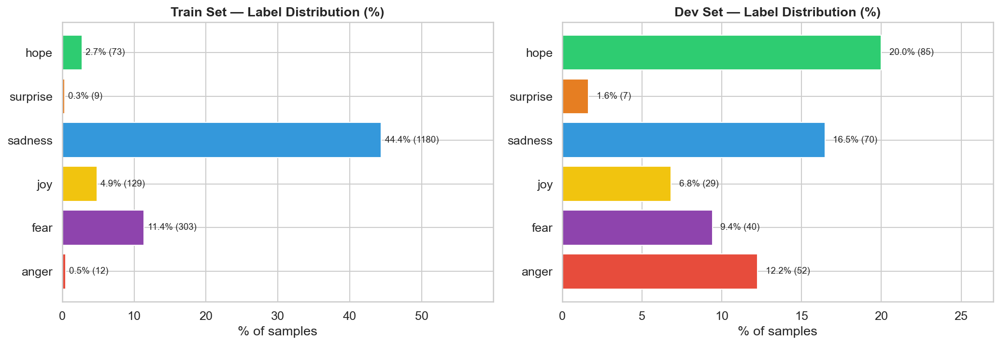
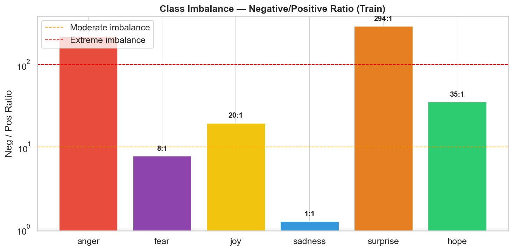
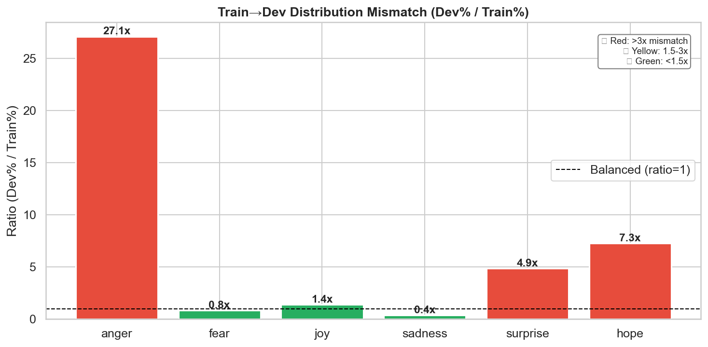
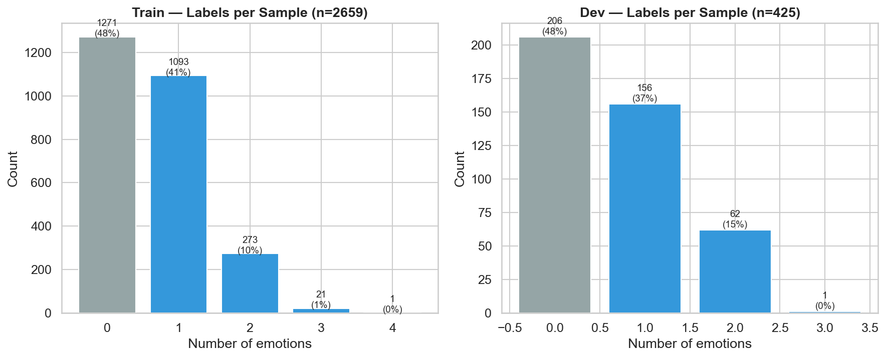
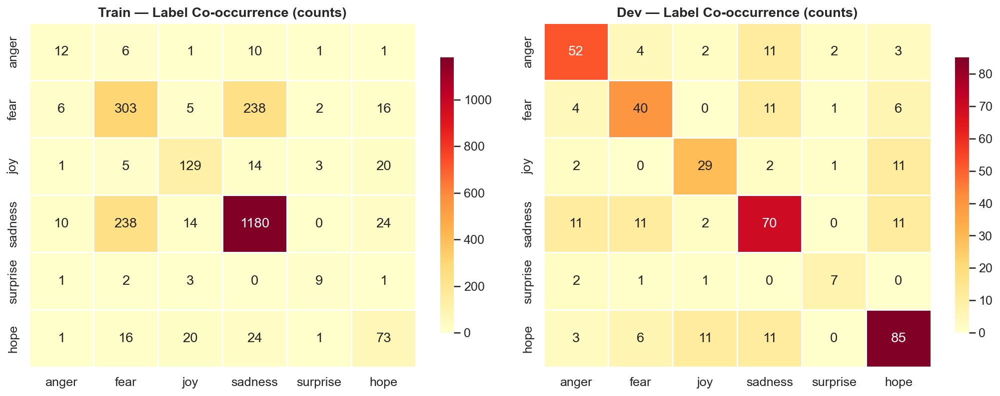
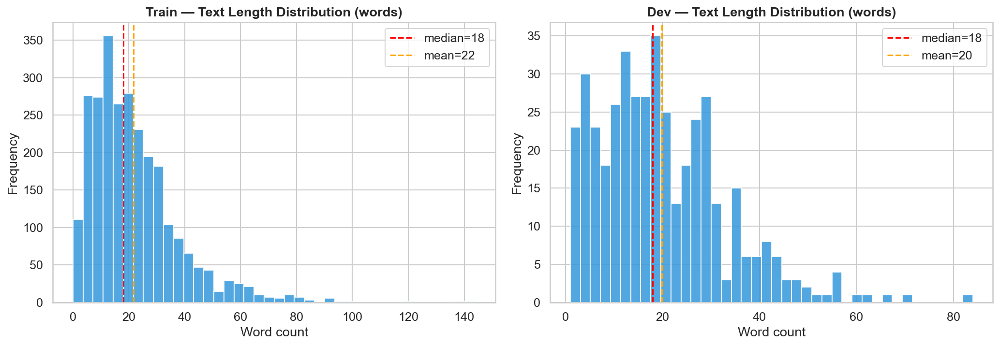
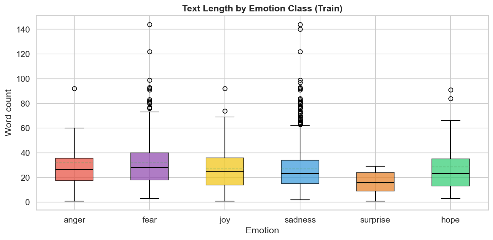

# Data Issues — HISEMOTIONS 2026

> Phân tích chi tiết các vấn đề dữ liệu ảnh hưởng đến hiệu năng mô hình.  
> Generated: 2026-03-18 | Train: 2,659 samples | Dev: 425 samples | Labels: 6 emotions

---

## Issue 1: 🔴 Extreme Class Imbalance (Train)

**Severity: CRITICAL**

Phân bố nhãn trong tập train cực kỳ mất cân bằng:

| Label | Count | % | Neg/Pos Ratio | Severity |
|-------|-------|---|---------------|----------|
| sadness | 1,180 | 44.4% | 1.3:1 | ✅ OK |
| fear | 303 | 11.4% | 7.8:1 | ⚠️ Moderate |
| joy | 129 | 4.9% | 19.6:1 | ⚠️ Moderate |
| hope | 73 | 2.7% | 35.4:1 | 🔴 Severe |
| **anger** | **12** | **0.5%** | **220.6:1** | 🔴 **Critical** |
| **surprise** | **9** | **0.3%** | **294.4:1** | 🔴 **Critical** |

**Impact**: Với macro-F1 = average F1 across 6 classes, anger và surprise (F1 ≈ 0) kéo toàn bộ metric xuống. Đây là **bottleneck #1** của hệ thống.

---

## Issue 2: 🔴 Train-Dev Distribution Mismatch

**Severity: CRITICAL**

Phân bố nhãn giữa Train (LLM-annotated) và Dev (human-annotated) **rất khác nhau**:

| Label | Train % | Dev % | Ratio (Dev/Train) | Issue |
|-------|---------|-------|-------------------|-------|
| anger | 0.5% | 12.2% | **24.4x** | 🔴 Extreme |
| hope | 2.7% | 20.0% | **7.4x** | 🔴 Severe |
| surprise | 0.3% | 1.6% | 4.9x | 🟡 Moderate |
| joy | 4.9% | 6.8% | 1.4x | ✅ OK |
| fear | 11.4% | 9.4% | 0.8x | ✅ OK |
| sadness | 44.4% | 16.5% | **0.4x** | 🟡 Over-represented |

**Root cause**: Train labels do **LLM semi-automatic annotation** → LLM bias:
- LLM gán quá nhiều sadness (44.4% train vs 16.5% dev)  
- LLM bỏ sót anger (0.5% train vs 12.2% dev) và hope (2.7% vs 20.0%)

**Impact**: Model learn từ biased distribution → predict sai trên dev (gold labels).

---

## Issue 3: 🟡 Nearly Half Samples Are Neutral

**Severity: MODERATE**

| Split | Neutral Samples | % |
|-------|----------------|---|
| Train | 1,271 / 2,659 | **47.8%** |
| Dev | 206 / 425 | **48.5%** |

**Distribution of label counts per sample (Train):**
- 0 labels (neutral): 1,271 (47.8%)
- 1 label: 1,093 (41.1%)
- 2 labels: 273 (10.3%)
- 3 labels: 21 (0.8%)
- 4 labels: 1 (0.0%)

Mean labels/sample = **0.64** — rất sparse.

**Impact**: Model dễ bias toward predicting "no emotion" cho mọi class. Threshold = 0.5 quá cao cho rare classes.

---

## Issue 4: 🟡 Sparse Multi-label Co-occurrence

**Severity: MODERATE**

**Observations:**
- Multi-label rất hiếm: chỉ ~11% samples có ≥2 labels
- Label co-occurrence chủ yếu giữa sadness + fear (phổ biến nhất)
- anger, surprise gần như không co-occur với label khác (quá ít data)
- Khó model label dependency khi co-occurrence data quá sparse

---

## Issue 5: 🟢 Text Length Variation

**Severity: LOW**

**Key observations:**
- Đa số fragments ngắn (median ~15-25 words)
- Một số fragments rất dài (100+ words)
- `max_length=128` tokens trong current config có thể đủ cho phần lớn, nhưng long fragments sẽ bị truncated
- Không có sự khác biệt lớn về text length giữa các emotion classes

---

## Summary: Priority của Các Vấn Đề

| # | Issue | Severity | Impact on Macro-F1 | Suggested Fix |
|---|-------|----------|-------------------|---------------|
| 1 | Extreme class imbalance | 🔴 CRITICAL | Trực tiếp kéo F1 xuống | Data augmentation + ASL loss |
| 2 | Train-Dev distribution mismatch | 🔴 CRITICAL | Model learn sai distribution | Verify/re-annotate train labels |
| 3 | ~48% neutral samples | 🟡 MODERATE | Model bias "no emotion" | Per-class threshold optimization |
| 4 | Sparse co-occurrence | 🟡 MODERATE | Khó model label dependency | Not critical for 6 labels |
| 5 | Text length variation | 🟢 LOW | Minor truncation | Increase max_length to 256 |

---

*Charts generated by `generate_data_issue_charts.py` | Data: train.csv (2,659), dev.csv (425)*
